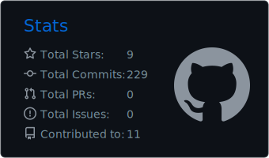
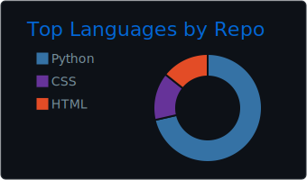
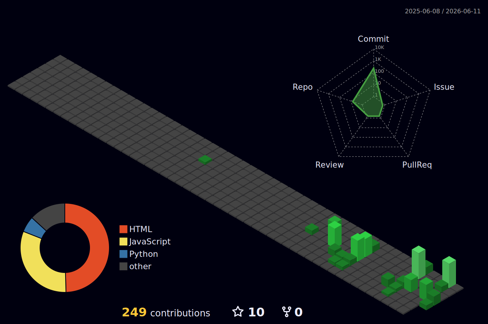

# Nozimjon Hamdamov

**`Backend Developer & AI Engineer`**

  
  
  
  

---

### 🧑‍💻 About Me

I'm a **Backend Developer** and **AI Engineer** based in Tashkent, Uzbekistan. Currently working at **MULTIBROKER** where I build intelligent backend systems and AI-powered solutions. I graduated from **Amity University in Tashkent** and have been professionally developing software with a focus on scalable backend architectures and machine learning applications.

- 🔭 Currently focused on **Backend Development**, **Artificial Intelligence** & **Machine Learning**
- 🌱 Exploring advanced **AI/ML frameworks** and **system design patterns**
- 🤝 Open to collaborating on **backend** and **AI** projects
- 📬 Reach me on **[Telegram](https://t.me/nozimjon_hamdamov)** — I'll respond promptly

---

### 🛠️ Tech Stack

**Languages**

**Backend & Frameworks**

**AI / ML**

**Databases**

**DevOps & Infrastructure**

**Messaging & APIs**

---

### 🚀 Featured Projects

| Project | Description | Tech |
|---------|-------------|------|
| [**Inbooks Print Bot**](https://github.com/n1kodev/Inbooks-print-telegram-bot) | Telegram bot for book printing service automation | Python, Telegram API |
| [**DGD Consulting**](https://github.com/n1kodev/DGD-Consulting) | Consulting company web platform | Python, Web |
| [**Fitora App**](https://github.com/n1kodev/Fitora-App) | Fitness tracking application | Python, Mobile |

---

### 📊 GitHub Stats

 

 

<picture>
  <source media="(prefers-color-scheme: dark)" srcset="./profile-3d-contrib/profile-night-green.svg" />
  <source media="(prefers-color-scheme: light)" srcset="./profile-3d-contrib/profile-green.svg" />
  
</picture>

---

  <i>Let's connect and build something great together!</i>

